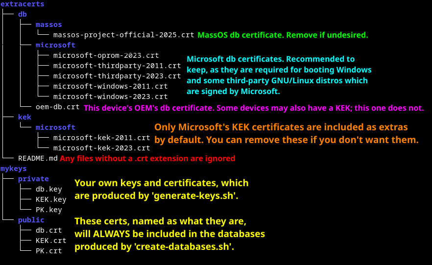

# extracerts
Place under this directory any additional PEM-encoded (`.crt`) certificates
that you want to be included in the finalized new secure boot databases, which
will be generated by the `create-databases.sh`.

Any additional Key Exchange Key (KEK) certificates go under the `kek/`
subdirectory, and any additional Authorized Signature (db) certificates go
under the `db/` subdirectory. It is important that you put the certificates in
the correct subdirectory. See the [top-level README.md file](../README.md) for
more information about this. Note that the `create-databases.sh` searches the
two aforementioned subdirectories recursively, and ignores any files without a
`.crt` file extension.

Under the top-level directory of this repository, there is a folder named
`extracerts.DEFAULT/`. This contains some commonly desired certificates for
both KEK and db, which you may or may not want to include in your databases.
To start, you can copy this entire directory over by running the following
command (from the top-level directory of this repository):
```sh
cp -r extracerts.DEFAULT/{db,kek} extracerts
```

By default, this default set contains the Microsoft certificates for both KEK
and db, as well as the official db certificate of [MassOS](https://massos.org).
If any of these are undesired, you can remove some or all of them. However, we
recommend keeping at least the Microsoft db certificates, as they will be
required for booting Windows and some Microsoft-signed GNU/Linux distributions.
However, if you want to ensure you have full control over the system, and don't
want Microsoft to be able to supply updates to db and dbx themselves, then you
may safely delete the Microsoft KEK certificates. This would mean that only you
can authorize db and dbx updates. More information about why this distinction
matters can be found in the [top-level README.md file](../README.md). You can
also safely remove the MassOS db certificate if you have no plans to boot or
use MassOS GNU/Linux. MassOS also does not have a KEK certificate.

**NOTE:** The certificate named "Microsoft Windows Production PCA 2011" was
revoked by Microsoft due to the **BlackLotus** bootkit vulnerability. It was
replaced by the "Windows UEFI CA 2023" certificate, which is now used to sign
Windows 11 23H2 and all future versions, as well as retroactively re-signing
existing installations of older versions of Windows 11 and Windows 10 via
Windows security updates. However **ALL** Microsoft-provided ISOs for Windows
11 versions older than 23H2, and **ALL Microsoft-provided Windows 10 ISOs**,
are signed by the older 2011 certificate. Only Windows 11 23H2 and newer ISOs
(or user-updated ones created via [UUPDump](https://uupdump.net/)) are / will
be signed by the new 2023 certificate. As a result of this, the authors of the
scripts in this repository have made the decision to keep the 2011 certificate
included at the current time. You can, of course, remove it if desired, since
as mentioned above, you can choose which certificates from the default set you
want to include or exclude. Note that, if you intend to use Microsoft's KEK
certificate, as described above, then Microsoft may push an update to your dbx
at any time, which dynamically revokes the certificate and makes it unusable
anyway. Note also that "Microsoft Corporation UEFI CA 2011", which has signed
third-party operating systems and bootloaders authorized by Microsoft, is NOT
revoked, and IS still valid. ONLY the Windows-specific 2011 certificate has
been revoked.

Some third party certificates may be distributed in the **DER** binary format,
instead of the default **PEM** format. Such certificates will instead use the
extension `.cer` or `.der`. You can use the OpenSSL command-line utility to
convert a **DER** certificate to a **PEM** one (replace `example` with the
actual name of the file):
```
openssl x509 -in example.der -inform DER -out example.crt -outform PEM
```

You may also wish to add OEM certificates for your device, which can be dumped
from your main system using the `dump-existing.sh` script, though this is only
required if some utility or function that is built-in to the firmware is signed
by such key. If this is not the case, you don't need OEM keys (and you probably
don't need to dump in the first place either, since most firmwares have a
"Restore Factory Keys" option). It should also be noted that `dump-existing.sh`
dumps ALL certificates, only one of which should be the OEM's own one. The
dumped certs will be placed in `dumped/KEK/crt` and `dumped/db/crt` for KEK and
db respectively. On any given `.crt` file, you can use the following command to
check which certificate it is:
```sh
openssl x509 -in NAME_OF_THE_CERTIFICATE_FILE.crt -noout -text
```
And look for the line containing something like the following output:
```sh
Subject: CN=Example OEM Certificate
```
And the CN should be the OEM's name, NOT "Microsoft" or "Windows". There may
also be other fields before CN, if the certificate also has physical address
information, but you can ignore this, and only take note of CN. Not all OEMs
will supply KEK or db keys, so you can ignore this entirely if this not the
case. But once you've found which `.crt` certificate corresponds to your OEM,
then you can copy it over to the `extracerts/` directory, again under the `db/`
or `kek/` subdirectory depending upon which type of certificate it is.

Here is an image showing the setup for an example system, with annotations to
help explain it:


